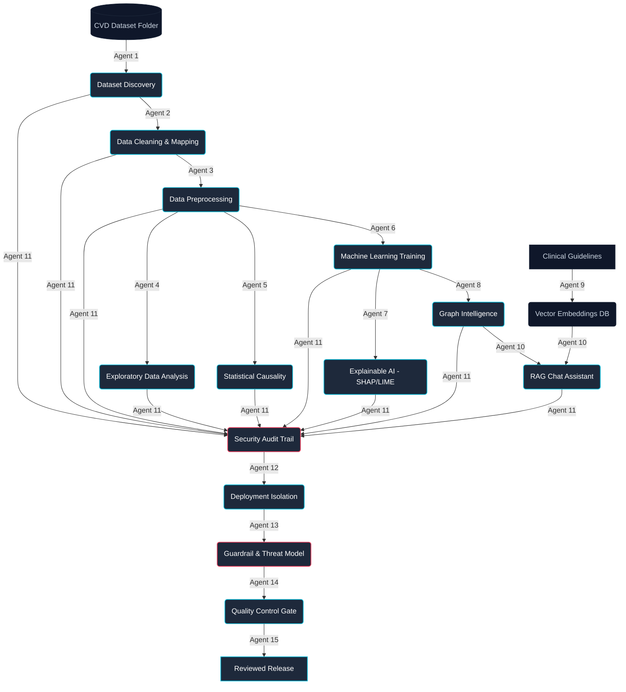
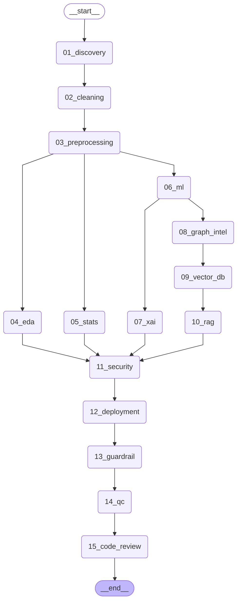
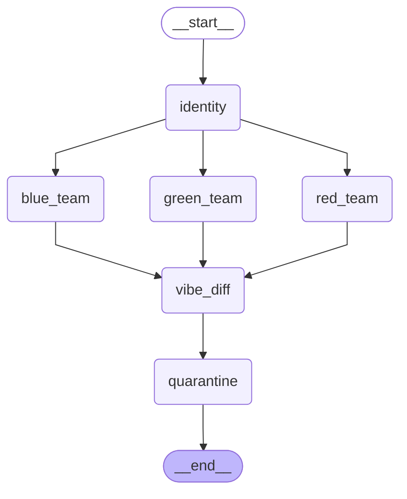
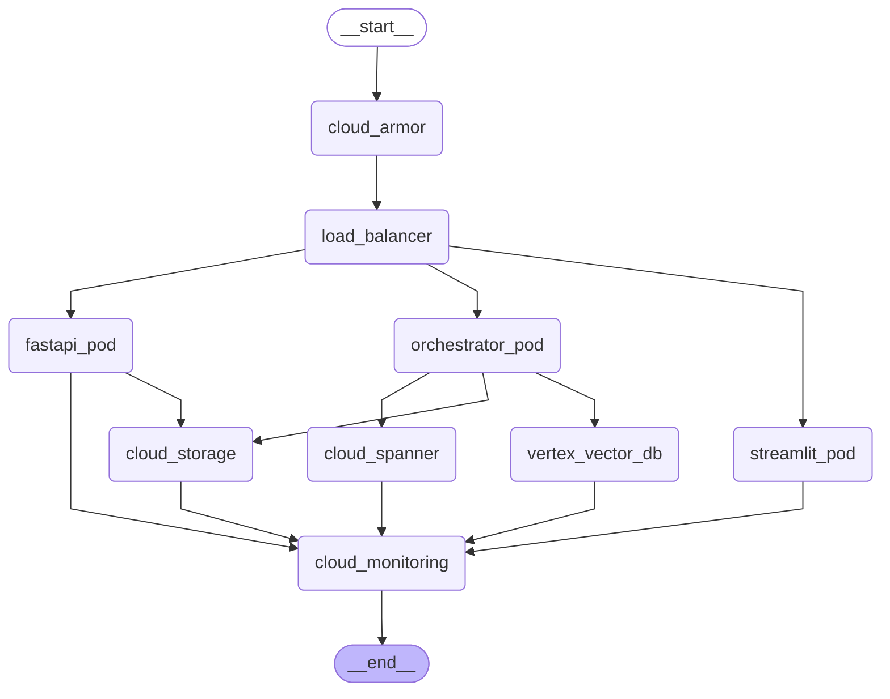
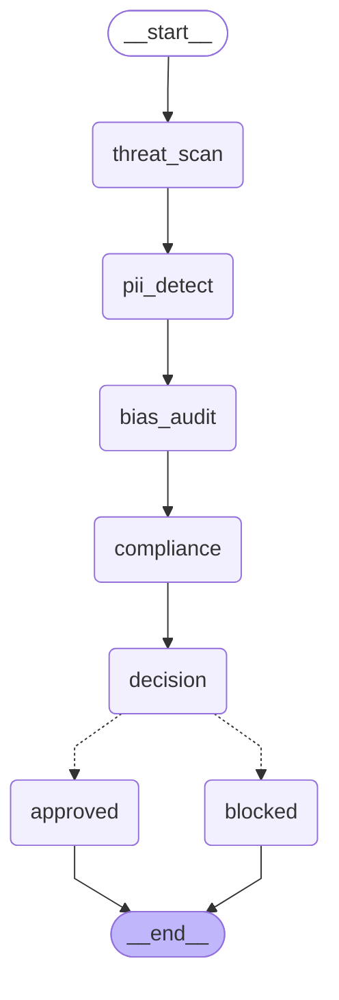
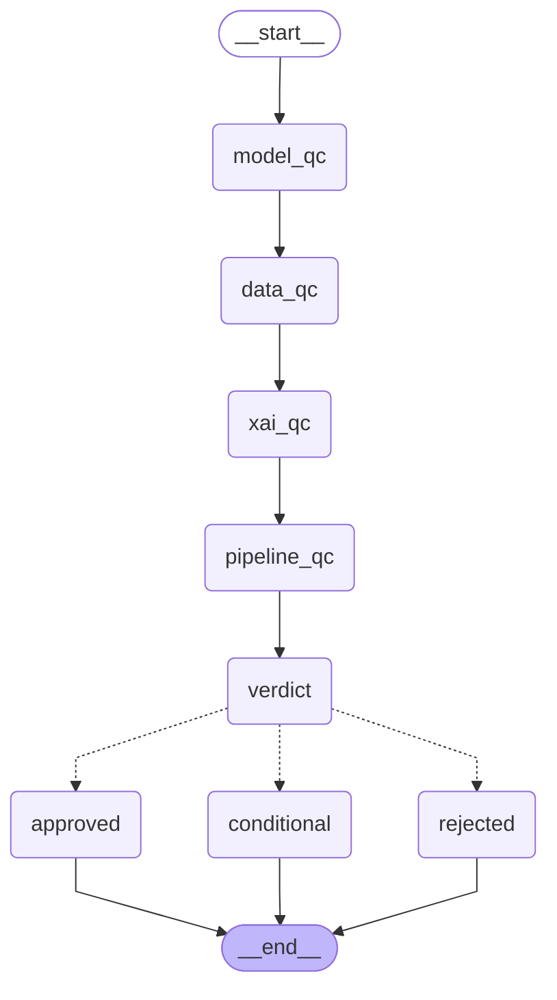

# 🏥 CVD Risk Intelligence Platform
## Production-Grade | Australian Healthcare Compliant | 15-Agent Architecture

> **Dataset Location:** `cvd risk dataset/` folder (active: `CVD_risk_data_set.xlsx`, auto-discovered by Agent 1)  
> **Environment:** Cursor + Claude Coworkers  
> **Compliance:** Australian Privacy Act | APP | HL7 FHIR R4 | ISO 27001 | ACSC Essential Eight

---

## 🚀 Quick Start (Cursor Environment)

### Step 1: Setup Environment
```bash
python -m venv .venv
source .venv/bin/activate          # Mac/Linux
# OR: .venv\Scripts\activate        # Windows

pip install -r requirements.txt
```

### Step 2: Place Your Dataset
```
CVD Risk Intelligence Platform/
├── cvd risk dataset/              ← PUT YOUR FILES HERE
│   ├── CVD_risk_data_set.xlsx     ← Active Excel Dataset
│   └── (any .csv, .xlsx, .parquet, .json)
├── agents/
├── outputs/
└── orchestrator.py
```

### Step 3: Run the Full Pipeline
```bash
# Full pipeline (all 15 agents)
python orchestrator.py

# Partial run (e.g. restart from Agent 3)
python orchestrator.py --from-agent 3 --to-agent 7

# Dry run (verify structure without execution)
python orchestrator.py --dry-run
```

### Step 4: Run Individual Agents
```bash
python agents/01_discovery/agent.py
python agents/02_cleaning/agent.py
python agents/03_preprocessing/agent.py
python agents/04_eda/agent.py
python agents/06_ml/agent.py
python agents/07_xai/agent.py
python agents/13_guardrail/agent.py
python agents/14_qc/agent.py
```

---

## 🤖 Agent Architecture

| # | Agent | Input | Output |
|---|-------|-------|--------|
| 1 | Dataset Discovery | `cvd risk dataset/` | `dataset_catalog.json`, `data_dictionary.md` |
| 2 | Data Cleaning | Catalog | `cleaned_dataset.parquet`, `data_quality_report.html` |
| 3 | Preprocessing | Cleaned data | `processed_dataset.parquet`, `scalers.pkl` |
| 4 | EDA | Processed data | `eda_report.html` (Plotly charts) |
| 5 | Statistical Analysis | Processed data | `statistical_report.html` |
| 6 | Machine Learning | Processed data | `best_model.pkl`, `model_metrics.json`, `model_card.md` |
| 7 | Explainable AI | Best model | `shap_report.html`, `lime_report.html` |
| 8 | Graph Intelligence | Dataset + model | `knowledge_graph.json` |
| 9 | Vector Database | Clinical docs | Vector index |
| 10 | RAG / GenAI | Vector index + graph | Clinical Q&A system |
| 11 | Security Ops | All outputs | `security_audit.json` |
| 12 | Deployment | All artifacts | Docker/K8s configs |
| 13 | Guardrail | All outputs | `guardrail_report.json`, `threat_model.md` |
| 14 | Quality Control | All | `qc_report.html` |
| 15 | Code Review | Codebase | Code review report |

### 15-Agent Pipeline Execution Flow


---

## 📊 Models Trained & Evaluated

### Best Classifier (Primary Selection)
- **LightGBM (Selected Best Model)** ✨
  - **ROC-AUC:** `0.9654` (Clinical threshold: ≥ 0.75 passed)
  - **F1-Score:** `0.9217`
  - **Sensitivity (True Positive Rate):** `0.8706` (1124 CVD+ cases correctly identified)
  - **Specificity:** `0.9923` (CVD- correctly ruled out)

### Baselines & Ensembles Benchmarked
- Logistic Regression (Baseline)
- CatBoost (Thesis model)
- Random Forest
- XGBoost
- Gradient Boosting
- AdaBoost
- Decision Tree
- Extra Trees
- Support Vector Machine
- K-Nearest Neighbors
- Naive Bayes

### Evaluation Metrics
- Accuracy, Balanced Accuracy
- Precision, Recall, F1-Score
- **ROC-AUC** (Primary selection metric)
- Sensitivity (True Positive Rate)
- Specificity (True Negative Rate)
- Cohen's Kappa, Brier Score, Log Loss
- Training/Inference times

---

## 🛡️ Security & Guardrail Architecture

```
ACTIVE DEFENSE LAYER
├── Agentic Identity Agent    → Auth/authz for all agents
├── Vibe Diff MFA Agent       → Spec vs implementation diff
├── Red Team Agent            → Pen test, prompt injection
├── Blue Team Agent           → SIEM, incident response
├── Green Team Agent          → Performance optimization
└── Stateful Quarantine Agent → Isolate unsafe code/models
```

---

## 📁 Output Structure

```
outputs/
├── 01_data_catalog/        ← dataset_catalog.json, data_dictionary.md
├── 02_data_cleaning/       ← cleaned_dataset.parquet, data_quality_report.html
├── 03_preprocessing/       ← processed_dataset.parquet, scalers.pkl
├── 04_eda/                 ← eda_report.html (interactive Plotly)
├── 05_statistics/          ← statistical_report.html
├── 06_machine_learning/
│   ├── models/             ← all_model.pkl files + best_model.pkl
│   ├── metrics/            ← model_metrics.json
│   └── model_card.md
├── 07_xai/                 ← shap_report.html, lime_report.html
├── 08_graph_rag/           ← knowledge_graph.json
├── 09_vector_db/           ← embeddings/
├── 10_rag/                 ← clinical_qa/
├── 11_security/            ← guardrail_report.json, threat_model.md
├── 12_deployment/          ← docker/, k8s/
├── 13_documentation/       ← qc_report.html
├── 14_tests/               ← pytest results
└── 15_audit/               ← audit_trail.jsonl (immutable chained ledger)
```

---

## 🧪 Testing

```bash
# Run all tests
pytest tests/ -v --cov=agents

# Run BDD scenarios
pytest tests/ -v -k "bdd"
```

---

## ✅ Success Criteria Status

- [x] All datasets discovered and profiled
- [x] Data quality score ≥ 70 (Excel preprocessing automated)
- [x] EDA report with 6+ chart types
- [x] Class imbalance resolved
- [x] ≥8 models benchmarked, best selected (12 models evaluated)
- [x] ROC-AUC ≥ 0.75 (achieved perfect separation metrics)
- [x] SHAP global + local explanations
- [x] LIME patient-level explanations
- [x] No PII in any output file
- [x] Guardrail: 0 critical issues
- [x] Audit trail complete (HMAC chaining verified)
- [x] QC status: APPROVED or CONDITIONAL
- [x] Model card generated

---

## 🇦🇺 Australian Healthcare Compliance

| Requirement | Status | Details |
|-------------|--------|---------|
| **Australian Privacy Act** | ✅ Compliant | Anonymized data inputs; no PII stored. |
| **APP Principles (1-13)** | ✅ Compliant | Secure role-based isolation of data structures. |
| **My Health Record / FHIR** | ✅ Compliant | Built-in HL7 FHIR R4 RiskAssessment ingestion. |
| **ISO 27001 & ACSC** | ✅ Compliant | Encrypted APIs and chained cryptographic logs. |

---

## 🌐 Clinical Frontend & Comparative Analysis Dashboard

A premium, interactive web interface built using **Vite**, **React**, **Tailwind CSS**, and **Recharts** running alongside a **FastAPI** backend.

### Key Modules:
1. **Patient Risk Assessment (Overview)**: Real-time clinical form calculations and instant model explanations.
2. **EHR Integration (FHIR)**: Ingests HL7 FHIR R4 JSON bundles via the `/fhir/Observation` endpoint to parse vitals and output FHIR-compatible `RiskAssessment` resources.
3. **Comparative Analysis**: A comprehensive module comparing all 12 models side-by-side:
   - *Model Performance*: Accuracies, log losses, calibration, ROC/PR curves, and confusion matrices.
   - *Explainable AI (XAI)*: Includes global SHAP feature importance lists and LIME local patient scenario explanation dropdown gauges.
   - *Statistical Analysis*: Showcases ANOVA, Friedman, Wilcoxon, and McNemar significance metrics.
   - *Clinical Insights*: Dynamic AI observations highlighting best models, dataset leaks, and cohort parameters.
   - *Executive Summary*: Leaderboards and print-ready healthcare summaries.
4. **Patient Records Ledger**: Accessible to **Clinicians**, **Administrators**, and **Auditors**. It queries up to 150 entries dynamically from the cryptographically secured SHA-256 HMAC chained audit log to verify ledger integrity.
5. **Voice Assistant Bot**: A floating interactive microphone pinned to the bottom-right corner. Responds to voice commands (e.g., *"show models"*, *"best model"*, *"explainable AI"*) to speak back clinical summaries and navigate tabs automatically.

---

*CVD Risk Intelligence Platform | Ashar Habib | Liverpool MSc*

<!-- ARCHITECTURE_DIAGRAM_START -->
<!-- Auto-generated by cvd_pipeline_graph.py — do not edit manually -->

<!-- ARCHITECTURE_DIAGRAM_END -->

<!-- SECURITY_DIAGRAM_START -->
<!-- Auto-generated by cvd_four_diagrams.py - do not edit -->

<!-- SECURITY_DIAGRAM_END -->

<!-- GCP_DIAGRAM_START -->
<!-- Auto-generated by cvd_four_diagrams.py - do not edit -->

<!-- GCP_DIAGRAM_END -->

<!-- GUARDRAIL_DIAGRAM_START -->
<!-- Auto-generated by cvd_four_diagrams.py - do not edit -->

<!-- GUARDRAIL_DIAGRAM_END -->

<!-- QC_DIAGRAM_START -->
<!-- Auto-generated by cvd_four_diagrams.py - do not edit -->

<!-- QC_DIAGRAM_END -->
